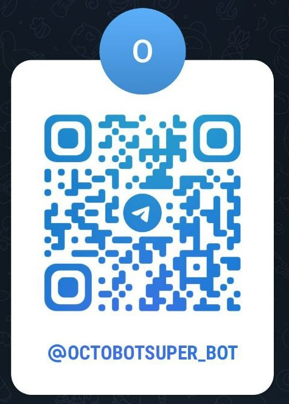

### Тг бота для администратора: 

### Структура проекта
```
/
├── app.py                    # Основной файл приложения с Flask сервером
├── .gitignore               # Список игнорируемых файлов для git
│
├── audio/                   # Директория для работы с аудио
│   ├── audio_data.json     # База данных аудио-фраз и путей
│   ├── audio_data.py       # Модуль загрузки аудио-данных
│   ├── redactor.py         # GUI-редактор аудио базы
│   └── files/              # Аудио файлы
│
├── components/             # Основные компоненты приложения
│   ├── routes.py          # Маршруты Flask приложения  
│   └── utils.py           # Вспомогательные функции
│
├── database/              # Файлы базы данных
├── dats/                 # Дополнительные данные
├── docker/               # Файлы для контейнеризации
└── examples/             # Примеры использования
```


### Дорожная карта Octobot

#### Неделя 1: Планирование и инициация проекта

- **Все участники**:
  - Определение целей и задач проекта.
  - Установление ключевых функций и ожидаемых результатов работы системы Octobot.
  - Подтверждение сроков разработки и этапов реализации, составление общего плана работ.

- **Python Backend**:
  - Инициализация репозитория и создание структуры проекта.
  - Проектирование схем баз данных для хранения информации о пользователях, визитах и вопросах-ответах.
  - Определение схем взаимодействия с фронтендом на Unity.
  - Составить список библиотек.

- **Unity Frontend**:
  - Настройка окружения разработки в Unity, подготовка проекта и его структуры.
  - Определение схемы взаимодействия с серверной частью, включая интерфейс для передачи данных.
  - Планирование сценариев взаимодействия пользователей с Octobot, определение ключевых механик работы системы с пользователем (распознавание лиц, голосовые команды).

- **3D-арт**:
  - Определение стиля и общей концепции 3D-моделей, которые будут использоваться в проекте.
  - Начало создания 3D-модели осьминога (Octobot), а также элементов окружения для взаимодействия пользователя с системой.
  - Определение основных параметров анимаций и стиля модели, соответствующего дизайну проекта.

---

#### Неделя 2: Начальная разработка и настройка архитектуры

- **Python Backend**:
  - Окончательная настройка баз данных.
  - Разработка и тестирование базовых API для распознавания лиц, регистрации визитов и хранения информации о них.
  - Реализация первых функций API для распознавания лиц, включая обработку и сохранение изображений в базе данных с использованием OpenCV и других библиотек.
  - Начало работы над голосовым взаимодействием: определение API для приёма голосовых данных и их обработки.

- **Unity Frontend**:
  - Создание базовых сцен и пользовательского интерфейса (UI) в Unity, включая элементы управления и отображения данных.
  - Реализация взаимодействия с Backend через HTTP-запросы для передачи данных о распознавании лиц и голосовых командах.
  - Настройка сетевого взаимодействия с сервером для корректной передачи данных, их обработки и получения ответа от Backend.
  - Проведение первых тестов интеграции с серверной частью и отладка механики передачи данных.

- **3D-арт**:
  - Завершение работы над базовой моделью осьминога, адаптация модели под технические требования Unity.
  - Проработка деталей модели: текстуры, материалы и общая визуальная стилизация для соответствия заданному художественному стилю проекта.
  - Начало работы над анимациями осьминога: определение ключевых анимаций (например, движения щупальцами, мимика).

---

#### Неделя 3: Разработка ключевых функций

- **Python Backend**:
  - Окончательная разработка модуля распознавания лиц с использованием машинного обучения и предварительно обученных моделей.
  - Тестирование работы API с имитацией реальных запросов от Unity, проверка стабильности и производительности.
  - Реализация функций голосового взаимодействия: разработка алгоритмов обработки речи и преобразования текста в ответные команды.
  - Начало создания системной логики для хранения и управления визитами, включая запись времени прихода и ухода пользователей.

- **Unity Frontend**:
  - Разработка логики взаимодействия осьминога с пользователем: запуск анимаций на основе ответов, получаемых от серверной части (например, приветствие при распознавании лица).
  - Реализация системы записи голосовых команд пользователя, передача их на Backend для обработки и получения ответа.
  - Интеграция модуля преобразования речи в текст (speech-to-text) и обратно для работы голосового интерфейса.
  - Продолжение работы над пользовательским интерфейсом: улучшение взаимодействия с пользователем, добавление новых интерактивных элементов.

- **3D-арт**:
  - Добавление текстур к 3D-моделям, детализация визуальных элементов для создания завершённого образа.
  - Разработка и тестирование анимаций осьминога, включая базовые движения и реакции на действия пользователя.
  - Начало работы над созданием дополнительных объектов окружения, которые будут взаимодействовать с Octobot в Unity.
  - Тестирование моделей и анимаций в Unity для обеспечения плавного взаимодействия и корректного отображения всех элементов.

---

#### Неделя 4: Интеграция и тестирование отдельных модулей

- **Все участники**:
  - Интеграция всех разработанных модулей в единую систему: распознавание лиц, голосовое взаимодействие и анимации осьминога.
  - Модульное тестирование каждого компонента, проверка синхронизации работы фронтенда и бэкенда.
  - Оптимизация производительности на основе результатов тестов: снижение задержек, улучшение стабильности системы, устранение обнаруженных ошибок.

- **Python Backend**:
  - Тестирование API на устойчивость при большом количестве запросов и под высокой нагрузкой.
  - Оптимизация взаимодействия с базой данных для быстрой обработки запросов от Unity.
  - Обеспечение стабильной работы всех функций, включая распознавание лиц, голосовые команды и регистрацию визитов.

- **Unity Frontend**:
  - Интеграция всех интерактивных элементов: запуск анимаций осьминога, воспроизведение голосовых ответов, взаимодействие с пользователем через UI.
  - Тестирование реакций осьминога на распознавание лиц и ответы на вопросы пользователя, проверка корректности взаимодействий.
  - Оптимизация сцен в Unity для повышения производительности и уменьшения времени отклика.

- **3D-арт**:
  - Завершение всех 3D-моделей и анимаций, внесение финальных корректировок на основе результатов тестов.
  - Оптимизация 3D-сцен и моделей для повышения производительности на целевых устройствах.

---

#### Неделя 5: Голосовое взаимодействие и пользовательская обратная связь

- **Python Backend**:
  - Окончательная реализация и тестирование запросов к базе данных для обработки голосовых команд и выдачи ответов пользователю.
  - Продолжение работы над обработкой естественного языка (NLP) для улучшения точности распознавания вопросов и генерации ответов.

- **Unity Frontend**:
  - Завершение интеграции голосовых функций с анимациями осьминога: обеспечение плавного взаимодействия и координации визуальных и голосовых откликов.
  - Финализация системы записи голосовых команд и их отправки на сервер для дальнейшей обработки.
  - Тестирование пользовательских сценариев взаимодействия с Octobot, получение обратной связи и корректировка работы системы.

- **3D-арт**:
  - Финальная настройка всех анимаций на основе данных от тестов в Unity.
  - Внесение правок в модели и окружение в соответствии с результатами обратной связи от команды разработки и тестировщиков.

---

#### Неделя 6: Полная интеграция системы

- **Все участники**:
  - Полная интеграция всех компонентов системы, включая распознавание лиц, голосовое взаимодействие, анимации и пользовательский интерфейс.
  - Проведение тестов с реальными пользователями, выявление проблем в работе системы, сбор данных для анализа.

---

#### Неделя 7: Комплексное тестирование и отладка

- **Все участники**:
  - Комплексное тестирование всей системы на целевых устройствах с учётом всех возможных сценариев использования.
  - Исправление ошибок, оптимизация пользовательского интерфейса и взаимодействий.
  - Сбор и анализ обратной связи от тестировщиков, внесение последних изменений для улучшения работы системы.

---

#### Неделя 8: Развертывание и финальные приготовления

- **Python Backend**:
  - Подготовка серверной части к финальному развертыванию, настройка системы мониторинга и логирования.
  - Завершение всех необходимых тестов на производительность и безопасность системы.

- **Unity Frontend**:
  - Подготовка финальной сборки приложения для развертывания на целевых устройствах.
  - Проведение заключительных тестов производительности и стабильности работы системы.

- **3D-арт**:
  - Финализация всех 3D-моделей, текстур и анимаций для финальной сборки проекта.

---

#### Неделя 9: Развертывание и обучение пользователей

- **Все участники**:
  - Развертывание системы на целевом оборудовании, таком как киоски или информационные стенды.
  - Тестирование работы системы с реальными камерами, микрофонами и экранами.
  - Обучение пользователей работе

 с Octobot, предоставление документации и рекомендаций по эксплуатации.

---

#### Неделя 10: Постразвертывание и финальные доработки

- **Все участники**:
  - Сбор обратной связи от пользователей после развертывания.
  - Внесение последних исправлений и оптимизация системы на основе реальных данных эксплуатации.
  - Проведение финальных улучшений перед завершением проекта, обеспечение полной стабильности работы системы.

---

### Взаимодействие между модулями

- **Python Backend**: Предоставляет API и серверные сервисы для работы с распознаванием лиц, голосовым взаимодействием, регистрацией визитов и другими функциями.
- **Unity Frontend**: Интегрирует серверную часть с приложением в Unity, обеспечивая все взаимодействия с пользователем, анимации и управление интерфейсом.
- **3D-арт**: Отвечает за создание и анимацию 3D-моделей для использования в Unity, включая осьминога и элементы окружения.

---

### Цели проекта

1. **Распознавание лиц**: Octobot должен корректно распознавать зарегистрированных пользователей и приветствовать их персонализированными сообщениями.
2. **Голосовое взаимодействие**: Пользователи должны иметь возможность задавать вопросы и получать ответы, которые будут озвучены Octobot с помощью технологий синтеза речи.
3. **Плавный пользовательский опыт**: Система должна обеспечивать интуитивный интерфейс и естественные, плавные анимации осьминога.
4. **Стабильность и надёжность системы**: Серверная часть должна быть способна эффективно обрабатывать запросы и обеспечивать минимальные задержки и высокую стабильность работы.

---

### Как запустить проект

#### Backend (Python):
1. Склонировать репозиторий с серверной частью проекта.
2. Настроить базы данных для хранения пользователей, визитов и вопросов-ответов.
3. Установить все необходимые зависимости, запустив команду: `pip install -r requirements.txt`.
4. Запустить сервер с помощью Flask или другого выбранного фреймворка.

#### Frontend (Unity):
1. Открыть проект в Unity Editor.
2. Убедиться, что все 3D-ассеты и анимации корректно импортированы и интегрированы в проект.
3. Настроить взаимодействие с API Backend для обмена данными (распознавание лиц, вопросы и ответы).
4. Собрать и развернуть приложение на целевом устройстве, протестировать работу системы.

#### 3D-ассеты:
Все 3D-модели и анимации должны быть импортированы в Unity, оптимизированы для производительности и интегрированы в основную сцену приложения.

---

### Лицензия
Проект распространяется под лицензией MIT. Подробности можно найти в файле [LICENSE](LICENSE).

---

## Бизнес-логика приложения Octobot

**Octobot** — это интеллектуальный цифровой ассистент для образовательного центра Octopus, который распознает лица учеников и помогает посетителям получать ответы на вопросы с помощью голосового интерфейса.

---

### Как это работает на практике

1. **Приветствие по имени**:
   - Как только ученик подходит к стенду с Octobot, камера сканирует его лицо.
   - Система сравнивает изображение с базой данных и, если находит совпадение, приветствует ученика по имени.
   - Если лицо не найдено в базе, Octobot предлагает представиться и добавить нового пользователя в систему.

2. **Запись посещений**:
   - Octobot фиксирует время прихода и ухода каждого ученика, создавая записи в базе данных.
   - Администраторы центра могут легко отслеживать посещаемость учеников.

3. **Ответы на вопросы**:
   - Octobot может отвечать на вопросы, задаваемые голосом, используя встроенную базу знаний.
   - Если вопрос не имеет ответа, Octobot может указать, что в данный момент информации нет.

---

### Преимущества использования Octobot

- **Автоматизация процесса записи посещений**: Octobot снимает необходимость ручного ведения учёта посещаемости.
- **Персонализированное взаимодействие**: Ученикам приятно, когда система приветствует их по имени, что создаёт комфортную атмосферу.
- **Полезная статистика**: Возможность анализа посещаемости и других данных.
- **Всегда готов помочь**: Octobot круглосуточно доступен для ответа на вопросы учеников.

---

### Структура базы данных

**1. Таблица `Participants`**:

| Поле               | Тип данных | Описание                                | Ограничения                       |
|--------------------|------------|-----------------------------------------|-----------------------------------|
| `id`               | INTEGER    | Уникальный ID участника                 | PRIMARY KEY, AUTOINCREMENT        |
| `name`             | TEXT       | Имя участника                           | NOT NULL                          |
| `face_embedding`   | BLOB       | "Цифровой отпечаток" лица участника     | NOT NULL                          |

**2. Таблица `Visits`**:

| Поле               | Тип данных | Описание                                | Ограничения                       |
|--------------------|------------|-----------------------------------------|-----------------------------------|
| `id`               | INTEGER    | Уникальный ID записи посещения          | PRIMARY KEY, AUTOINCREMENT        |
| `participant_id`   | INTEGER    | ID участника                            | NOT NULL, FOREIGN KEY (ссылка на `Participants.id`) |
| `arrival_time`     | TEXT       | Время прихода                           |                                   |
| `departure_time`   | TEXT       | Время ухода                             |                                   |

**3. Таблица `QA`**:

| Поле               | Тип данных | Описание                                | Ограничения                       |
|--------------------|------------|-----------------------------------------|-----------------------------------|
| `id`               | INTEGER    | Уникальный ID вопроса                   | PRIMARY KEY, AUTOINCREMENT        |
| `question`         | TEXT       | Текст вопроса                           | NOT NULL                          |
| `answer`           | TEXT       | Текст ответа                            | NOT NULL                          |

**Связи между таблицами**:
- Таблица `Participants` связана с таблицей `Visits` отношением "один ко многим", что позволяет фиксировать множество посещений одного участника.

---

**Octobot** обеспечивает простое, интуитивное взаимодействие с пользователями, значительно упрощая управление процессами в образовательном центре и создавая комфортные условия для учеников.


